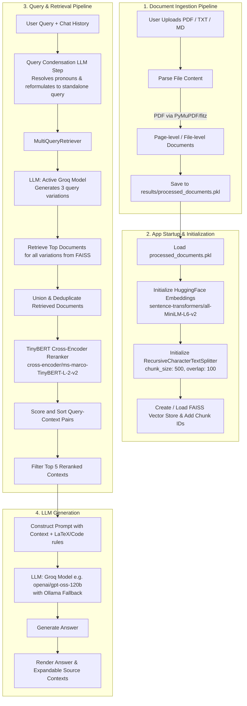

# RAG Chatbot with Multi-Query Retrieval and TinyBERT Reranking

An advanced Retrieval-Augmented Generation (RAG) chatbot built with Streamlit, LangChain, Groq (OpenAI GPT-OSS / Qwen), and local embedding & reranking models.

This chatbot includes a self-contained web interface for document ingestion (supporting PDF, TXT, and MD files), automated chunking, vector storage with FAISS, multi-query expansion to improve retrieval recall, and cross-encoder reranking to select the most relevant contexts before sending them to the LLM.

---

## Architecture Diagram

The diagram below illustrates the detailed architecture of the document ingestion pipeline and the query/response generation workflow:



---

## Tech Stack & Core Components

- **Chunker**: `RecursiveCharacterTextSplitter` (from `langchain_text_splitters`)
  - **Configuration**: `chunk_size = 500` characters, `chunk_overlap = 100` characters.
  - **Separators**: `["\n\n", "\n", ". ", "? ", "! ", "; ", ", ", " ", ""]` (maintains semantic cohesion).
- **Embedding Model**: `sentence-transformers/all-MiniLM-L6-v2` (loaded locally via LangChain's `HuggingFaceEmbeddings` on CPU).
- **Vector Database**: `FAISS` (Facebook AI Similarity Search) manages the index for fast local vector retrieval.
- **Reranker**: `cross-encoder/ms-marco-TinyBERT-L-2-v2` (loaded locally via `sentence_transformers.CrossEncoder`, keeping top **5** context chunks).
- **LLM Model**:
  - **Primary**: `openai/gpt-oss-120b`, `openai/gpt-oss-20b`, `qwen/qwen3.6-27b` (hosted via the Groq API, selectable in UI).
  - **Local Fallback**: Local Ollama instances (e.g., `llama3.2:1b`, `gemma3:1b`, or `qwen2.5-coder:7b`) are automatically selected if the primary API fails.
- **Query Optimization Techniques**:
  1. **Contextual Query Condensation / Reformulation**: A custom LLM prompt analyzes the conversation history and the follow-up question. If pronouns (like "it", "they", "this") or vague references are found, it reformulates the prompt into a standalone question.
  2. **Multi-Query Retrieval (Query Expansion)**: A custom prompt template forces the LLM to write **3 alternative formulations** targeting different perspectives, expansion of abbreviations/jargon, mathematical equations, and simplified sub-queries, which are then queried in parallel against FAISS to boost retrieval recall.

---

## Detailed Architecture Flow

The system operates across four primary pipeline stages, detailed step-by-step below:

### 1. Document Ingestion Phase (Sidebar UI)

- **File Upload**: The user uploads files (`.pdf`, `.txt`, `.md`) via the Streamlit sidebar.
- **Extraction**:
  - For PDFs: The `PyMuPDF` (`fitz`) library reads page-by-page, extracting clean text strings.
  - For TXT/MD: The file contents are read directly and decoded as `utf-8`.
- **Document Object Creation**: Raw text snippets are wrapped in LangChain `Document` objects. Metadata including `filename` and `page_label` are attached to enable source attribution.
- **Persistence**: The extracted list of `Document` objects is serialized and saved to `results/processed_documents.pkl`.

### 2. Startup, Chunking & Vectorization Phase

- **Pickle Load**: Upon startup or re-run, the app checks for the existence of `results/processed_documents.pkl` and deserializes it.
- **Text Chunking**: The list of documents is passed to a `RecursiveCharacterTextSplitter` with:
  - `chunk_size = 500` characters (ensuring context fits nicely within LLM attention windows).
  - `chunk_overlap = 100` characters (maintaining contextual continuity across chunk boundaries).
  - Unique IDs (`chunk_id`) are generated and appended to the metadata of each chunk (crucial for deduplication).
- **Vector Index Creation**:
  - Local embedding computation is initiated using the `sentence-transformers/all-MiniLM-L6-v2` model.
  - A `FAISS` vector store index is created from these embedded chunks and cached in memory.

### 3. Multi-Query Retrieval & Cross-Encoder Reranking

- **Query Input**: The user enters a question in the Streamlit chat box.
- **Query Condensation**: The conversation history and user query are analyzed by the LLM. If the query is contextual, it is reformulated into a standalone query.
- **Multi-Query Expansion**:
  - The standalone query is passed to the `MultiQueryRetriever`.
  - The LLM is prompted with a custom instruction to generate **3 alternative queries** targeting different perspectives, terminologies, and formulations.
- **Vector Search**: All 3 query variations query the FAISS index (retrieving the top 5 nearest neighbors for each variation).
- **Recall Optimization & Deduplication**: The resulting sets of document chunks are merged, and duplicates (based on the chunk's unique `chunk_id` metadata) are removed to increase retrieval recall.
- **TinyBERT Reranking**:
  - The standalone query and all deduplicated chunks are combined into pairs.
  - A local Cross-Encoder model (`cross-encoder/ms-marco-TinyBERT-L-2-v2`) calculates a relevance score for each query-chunk pair.
  - Chunks are sorted by score, and only the **Top 5** highest-scoring chunks are kept. This alleviates "lost-in-the-middle" issues by ensuring the most relevant contexts are prioritized.

### 4. Context Grounding & Response Generation

- **Context Construction**: The page content of the Top 5 reranked chunks is concatenated into a single cohesive context block.
- **System Prompt Grounding**: The query and context block are formatted into a system-guided template instructing the LLM to use **only** the provided context and say "I don't know" if the answer cannot be found. Custom rules enforce formatting math in LaTeX (`$`/`$$`) and code in markdown blocks.
- **LLM Invocation**: The formatted prompt is sent to the selected Groq model (e.g., `openai/gpt-oss-120b`, or the local fallback model via Ollama if enabled).
- **UI Display**: The generated answer is streamed/printed to the Streamlit chat window. The metadata and content of the source chunks are displayed inside an expandable UI component below the chat bubble.

---

## Setup & Installation

### Prerequisites

- Python 3.9 to 3.13
- Anaconda or Miniconda (recommended)
- A Groq API Key (get one from [Groq Console](https://console.groq.com/))

### Installation Steps

1. **Clone or navigate to the repository directory**:

   ```bash
   cd Streamlit_Chatbot_v2
   ```

2. **Create and activate the Conda environment**:

   ```bash
   conda create -n iit_streamlit_chatbot python=3.11
   conda activate iit_streamlit_chatbot
   ```

3. **Install the dependencies**:

   ```bash
   pip install -r requirements.txt
   ```

4. **Configure environment variables**:
   Create a `.env` file in the root of the project and add your Groq API key:
   ```env
   GROQ_API_KEY=your_actual_groq_api_key_here
   ```

---

## Running the Chatbot

Start the Streamlit application:

```bash
streamlit run app.py
```

### Usage Workflow

1. **Upload Documents**: When the application opens, look at the sidebar on the left. Use the file uploader to select one or more PDF, TXT, or MD documents.
2. **Process**: Click **Process & Ingest**. The app will extract the text, create the vector store, and initialize the models.
3. **Chat**: Once ingested, the main interface will open the chat screen. You can ask questions about the contents of your uploaded files.
4. **Review Contexts**: Every response contains an expandable section showing the exact top 5 reranked text snippets that were retrieved and sent to the LLM.
5. **Clear / Reset**: Click **Clear Documents** in the sidebar at any time to delete the cached knowledge base and upload new documents.
