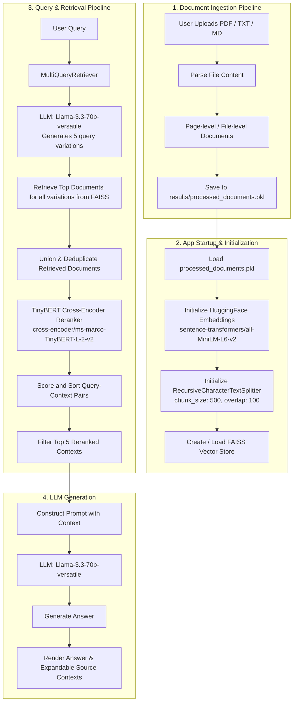

# RAG Chatbot with Multi-Query Retrieval and TinyBERT Reranking

An advanced Retrieval-Augmented Generation (RAG) chatbot built with Streamlit, LangChain, Groq (Llama 3.3 70B), and local embedding & reranking models. 

This chatbot includes a self-contained web interface for document ingestion (supporting PDF, TXT, and MD files), automated chunking, vector storage with FAISS, multi-query expansion to improve retrieval recall, and cross-encoder reranking to select the most relevant contexts before sending them to the LLM.

---

## Architecture Diagram

The diagram below illustrates the detailed architecture of the document ingestion pipeline and the query/response generation workflow:



---

## Core Components & Technologies

1. **User Interface**: [Streamlit](https://streamlit.io/) provides a clean chat interface along with a sidebar panel for managing and ingesting documents.
2. **Ingestion & Parsing**: `pypdf` extracts text from uploaded PDF documents on the fly.
3. **Chunking**: `RecursiveCharacterTextSplitter` segments text into manageable chunks of `500` characters with `100` characters overlap.
4. **Embeddings**: `HuggingFaceEmbeddings` loads `sentence-transformers/all-MiniLM-L6-v2` locally for semantic vector generation.
5. **Vector Database**: `FAISS` (Facebook AI Similarity Search) manages the index for efficient similarity searches.
6. **Multi-Query Retrieval**: A `MultiQueryRetriever` uses the Groq LLM to write 5 alternative formulations of the user's query, broadening the scope of search and boosting retrieval recall.
7. **Reranker**: A local `CrossEncoder` using `cross-encoder/ms-marco-TinyBERT-L-2-v2` reranks the combined retrieved documents based on exact query compatibility, mitigating "lost in the middle" effects.
8. **Generation Model**: `ChatGroq` interfaces with the high-performance `llama-3.3-70b-versatile` model to generate context-grounded answers.

---

## Setup & Installation

### Prerequisites
- Python 3.9 to 3.13
- Anaconda or Miniconda (recommended)
- A Groq API Key (get one from [Groq Console](https://console.groq.com/))

### Installation Steps

1. **Clone or navigate to the repository directory**:
   ```bash
   cd Streamlit_Chatbot_v2
   ```

2. **Create and activate the Conda environment**:
   ```bash
   conda create -n iit_streamlit_chatbot python=3.11
   conda activate iit_streamlit_chatbot
   ```

3. **Install the dependencies**:
   ```bash
   pip install -r requirements.txt
   ```

4. **Configure environment variables**:
   Create a `.env` file in the root of the project and add your Groq API key:
   ```env
   GROQ_API_KEY=your_actual_groq_api_key_here
   ```

---

## Running the Chatbot

Start the Streamlit application:
```bash
streamlit run app.py
```

### Usage Workflow
1. **Upload Documents**: When the application opens, look at the sidebar on the left. Use the file uploader to select one or more PDF, TXT, or MD documents.
2. **Process**: Click **Process & Ingest**. The app will extract the text, create the vector store, and initialize the models.
3. **Chat**: Once ingested, the main interface will open the chat screen. You can ask questions about the contents of your uploaded files.
4. **Review Contexts**: Every response contains an expandable section showing the exact top 5 reranked text snippets that were retrieved and sent to the LLM.
5. **Clear / Reset**: Click **Clear Documents** in the sidebar at any time to delete the cached knowledge base and upload new documents.
