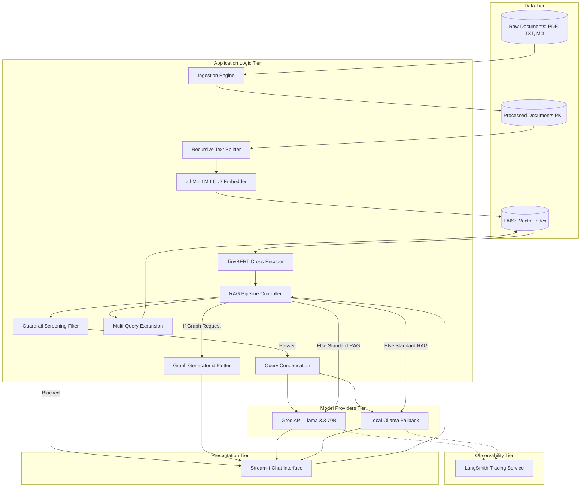

# System Architecture

This document describes the high-level architecture and system components of the RAG Chatbot.

---

## 1. High-Level Architecture

The chatbot is structured into four main operational blocks: **Document Ingestion**, **Vector Indexing & Storage**, **Context Retrieval & Ranking**, and **Response/Graph Generation**.

---

## 2. Technical Stack Specifications

| Component | Technology | Configuration / Settings | Purpose |
| :--- | :--- | :--- | :--- |
| **Frontend/App Framework** | Streamlit | Session State, Chat bubbles, Sidebar | User interface, file management, status dashboard. |
| **Text Parsing** | PyMuPDF (`fitz`), native files | Page-by-page extraction for PDFs; UTF-8 read for txt/md. | Reading document files. |
| **Text Splitter** | `RecursiveCharacterTextSplitter` | `chunk_size = 500`, `chunk_overlap = 100` characters | Splitting long documents into manageable, cohesive text blocks. |
| **Embedding Model** | `sentence-transformers/all-MiniLM-L6-v2` | Loaded locally via LangChain's HuggingFaceEmbeddings | Creating mathematical vector representations of text chunks. |
| **Vector DB** | `FAISS` | In-memory index, index-saving/loading | Fast similarity search against embeddings. |
| **Reranking Model** | `cross-encoder/ms-marco-TinyBERT-L-2-v2` | Loaded locally via SentenceTransformers CrossEncoder | Re-scoring retrieved chunks against the query to ensure high relevance. |
| **Guardrails Filter** | LLM-based custom prompt | Temperature: 0.0, strict categorization | Inspecting user input for security and topical relevance. |
| **Graphing Module** | `matplotlib` | Custom JSON extraction prompt, Matplotlib rendering | Automatically plotting data retrieved from chunks. |
| **Primary LLM** | Groq (`llama-3.3-70b-versatile`) | Temperature: 0.0 / 0.1, system-grounding prompt | Query condensation, query expansion, graph data extraction, and response generation. |
| **Fallback LLM** | Ollama (Local) | Auto-detects local running models | Fallback LLM when API is offline or rates are limited. |
| **Observability** | LangSmith | `LANGSMITH_TRACING=true` via environment variables | Logging, tracking, and debugging RAG pipeline steps. |

---

## 3. Key Design Decisions

### 1. In-Memory FAISS Vector Store
- **Why**: Keeps setup simple without requiring a dedicated Docker container or external cloud database (like Pinecone/Chroma).
- **How**: Instantiated at application boot time from parsed text chunks, making the application fully self-contained.

### 2. Multi-Query Expansion
- **Why**: Standard similarity searches are sensitive to keyword matches. Multi-query writes alternative versions of the question to capture synonyms, abbreviations, and different linguistic framings.
- **Result**: Increases retrieval recall significantly by searching the vector index multiple times with complementary queries.

### 3. Cross-Encoder Reranking
- **Why**: Bi-Encoders (standard embeddings) compare document-to-document representations quickly but miss finer query-to-context semantic correlations. Cross-Encoders evaluate the query and document *together*, achieving significantly higher ranking accuracy.
- **Result**: Drastically reduces hallucination and mitigates "lost-in-the-middle" issues by ordering the top 5 most relevant documents for the LLM.

### 4. Input Guardrails
- **Why**: Prevents jailbreaks, prompt injection, and unrelated chit-chat, focusing the LLM purely on academic documents, research queries, and authorized tasks like plotting data.

### 5. Automated Graph Generation
- **Why**: Users analyzing research papers or tabular data often need visual graphs. The system parses the question, extracts raw numbers into validated JSON, and plots line, bar, or scatter charts automatically using Matplotlib.
