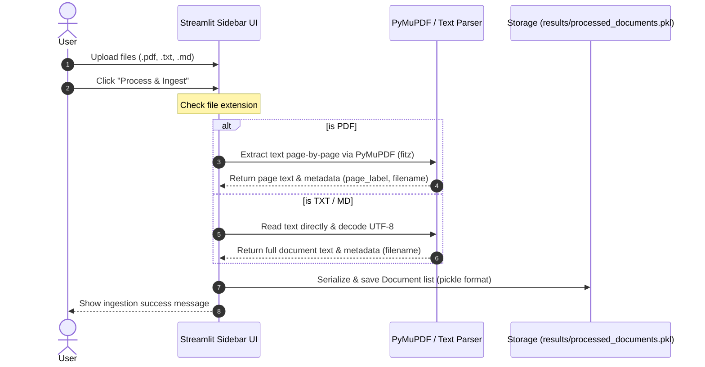
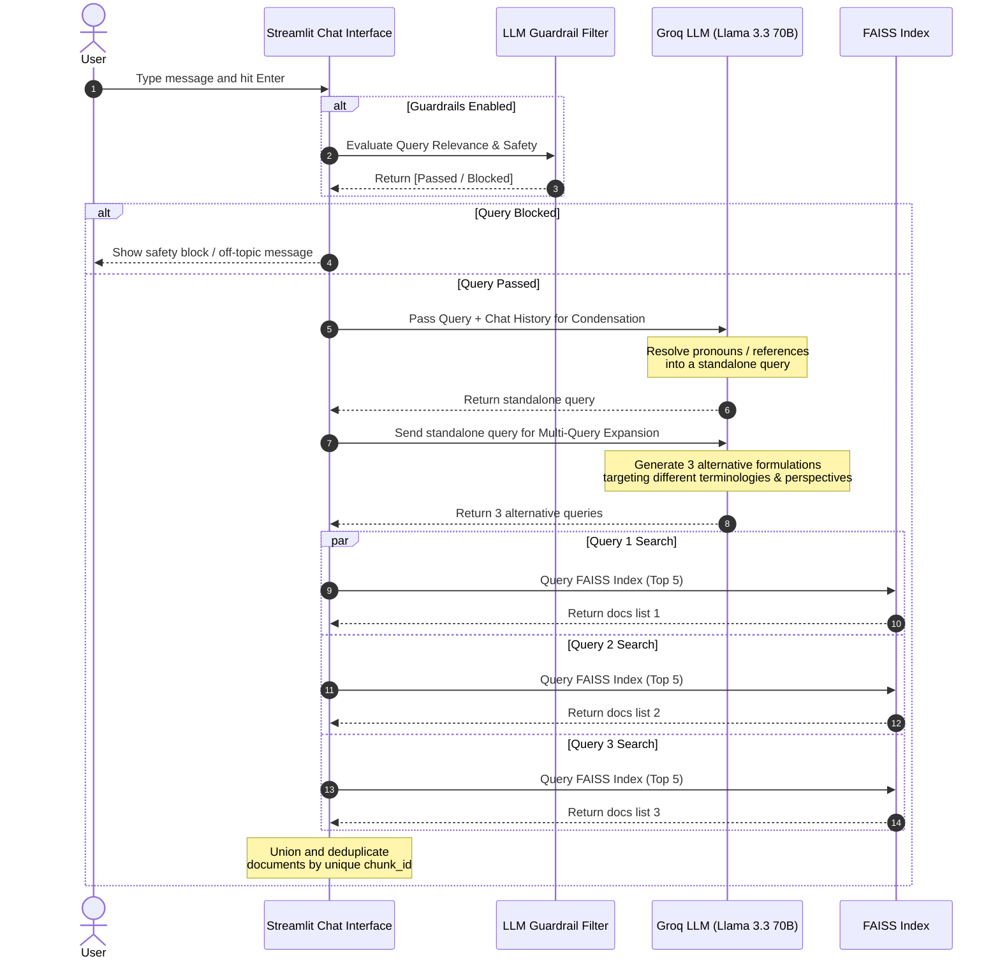
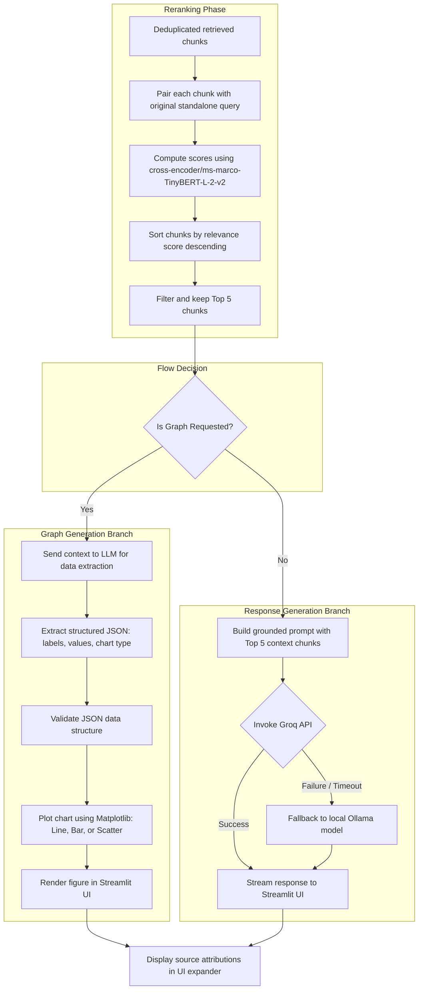

# Operational Flows & Sequence Diagrams

This document details the exact process flows within the RAG Chatbot, visualizing how documents are ingested, and how queries are processed, filtered, expanded, retrieved, reranked, and checked for graph generation.

---

## 1. Document Ingestion Flow

The ingestion pipeline handles the file uploading, parsing, metadata extraction, and pickle serialization.

---

## 2. Guardrails & Query Processing Flow

When a user submits a query, it is first evaluated by a security and relevance guardrail. If it passes, it proceeds to condensation, expansion, and vector retrieval.

---

## 3. Reranking, Graph Generation & Response Flow

After retrieving chunks, they are reranked. If the query asks for a graph, the chatbot extracts structured data from the context and plots it using Matplotlib. Otherwise, it generates a standard text response.

